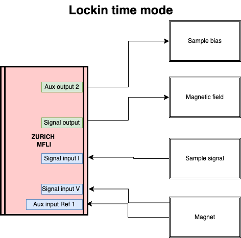
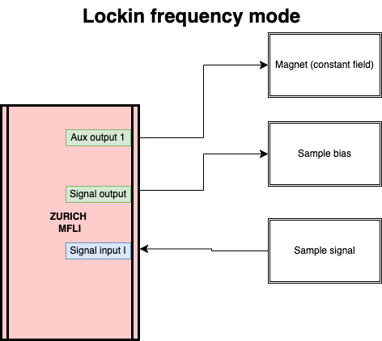
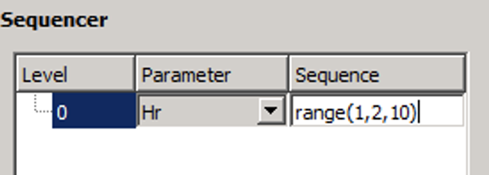

# NoiseMeasurement App 

## Connections: 

### 1. Lockin Time: 




### 2. Lockin field: 


### 3. Lockin frequency: 




## Hdc Mode 

In order to use the option of setting a field vector with the variable “Hr”, it is necessary to enter a vector in the “Vector” field, the last element of which will be the variable “Hr” as in the example below. 

```python 
0,1,10,4,20,5,Hr
```
Then, from the sequencer, select the change by the parameter “Hr” and enter the range of its variation: 
